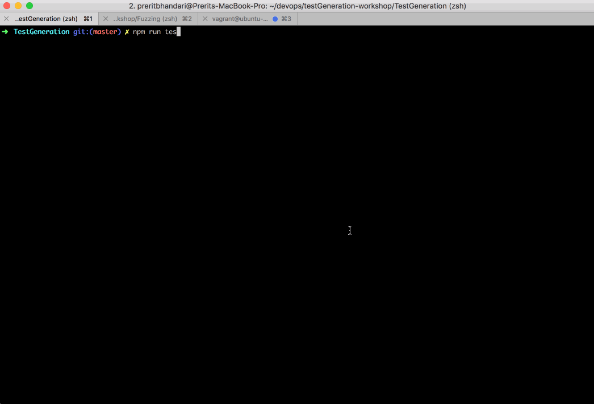
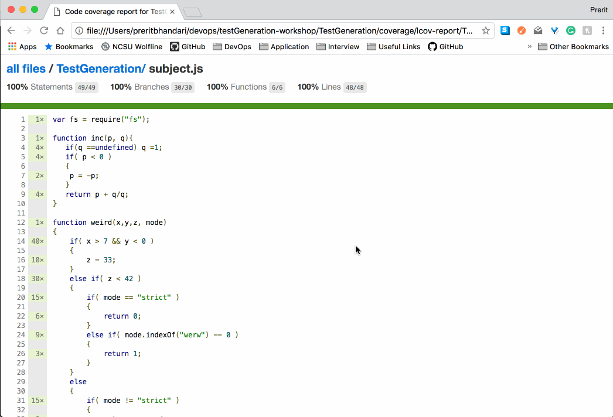

# HW #2 Test Generation and Coverage

## Setup

    baker bake --repo https://github.ncsu.edu/pbhanda2/CSC519-HW2.git
    baker ssh testgen
    cd /CSC519-HW2
    npm install
    node main.js
    npm run test

##### See a fully annotated html report here:
Exit the baker machine and type the following in your terminal:
    
    open coverage/lcov-report/CSC519-HW2/index.html
    start coverage/lcov-report/CSC519-HW2/index.html (Windows)

## Screenshots

### subject.js  

### mystery.js   

